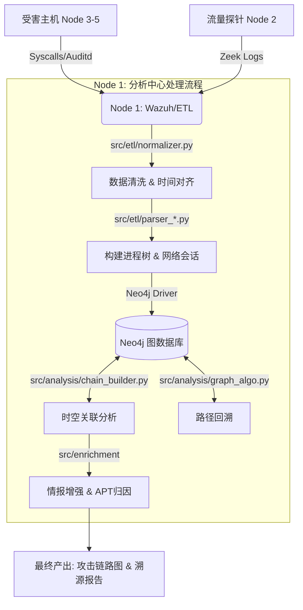

根据 `FusionTrace` 项目的目录结构，该系统是一个**基于多源数据融合（端+网）的攻击溯源与威胁分析平台**。系统通过整合主机日志（Auditd）和网络流量日志（Zeek），构建攻击链路图谱，并结合威胁情报进行 APT 组织画像。

以下是基于文件结构的详细**系统工作流程（Workflow）**：

---

### 1. 基础设施部署与初始化 (Deployment Phase)
系统首先在 5 个节点上进行分布式部署，建立基础感知网络。

*   **受害主机侧 (Nodes 3, 4, 5)**:
    *   通过 `deploy/sensor-agent/install.sh` 进行一键部署。
    *   **关键动作**: 脚本会自动配置 **NTP 时间同步**（确保多节点日志时间戳一致，这是后续关联分析的基础），并加载 `audit.rules` 内核审计规则，重点监控进程创建、文件修改及内存注入行为。
*   **流量探针侧 (Node 2)**:
    *   通过 `deploy/sensor-network/docker-compose.yml` 启动 Zeek 容器。
    *   加载 `detection.zeek` 脚本，专门用于捕获隐蔽信道（如 DNS Tunneling 或 ICMP exfiltration）。
*   **分析中心侧 (Node 1)**:
    *   通过 `deploy/server/docker-compose.yml` 编排启动 Wazuh Manager（日志收集）、Neo4j（图数据库）和自定义的 ETL 引擎容器。

### 2. 多维数据感知与采集 (Sensing & Collection Phase)
攻击发生时，系统从“端”和“网”两个维度捕获数据。

*   **端侧数据 (Endpoint)**: Linux Agent 根据 `auditd_decoder.xml` 的规则，捕获系统调用（Syscalls），并将其转化为 Wazuh 可识别的 KV 格式。
*   **网侧数据 (Network)**: Zeek 探针实时分析流量，生成 JSON 格式的连接日志，并通过 `detection.zeek` 标记异常隧道流量。
*   **汇聚**: 所有数据统一汇总至 Node 1 的 Wazuh Manager 或日志落盘目录。

### 3. 数据融合与 ETL 处理 (Fusion & ETL Phase)
这是 `src/etl/` 目录发挥作用的核心阶段，旨在将异构日志转化为统一的数据模型。

1.  **提取 (Collector)**: `collector.py` 从 Wazuh 和 Zeek 拉取原始日志。
2.  **清洗与范式化 (Normalization)**:
    *   `normalizer.py` 处理最关键的**时间对齐**问题（处理不同时区、不同日志源的时间偏差）。
    *   将非结构化日志字段映射为标准字段（依据 `config/neo4j_schema/schema_map.json`）。
3.  **实体构建 (Parsing)**:
    *   `parser_process.py`: 根据 PID/PPID 构建**进程树**（Process Tree），还原 `Parent -> Child` 的衍生关系。
    *   `parser_network.py`: 重建**网络会话**，提取五元组信息。

### 4. 图谱构建与存储 (Graph Construction Phase)
处理后的数据被存入图数据库，形成攻击全景图。

*   **Schema 约束**: 系统加载 `config/neo4j_schema/constraints.cyp`，通过 UUID 或 MD5 确保节点（文件、IP、进程）的唯一性，防止数据重复。
*   **入库**: 解析后的实体（节点）和关系（边）被写入 Neo4j 数据库。
    *   *节点示例*: `Process`, `File`, `IP`, `Domain`.
    *   *关系示例*: `SPAWNED`, `CONNECTED_TO`, `WROTE_TO`.

### 5. 攻击链分析与溯源 (Analysis Phase)
利用图算法和规则引擎进行深度分析，对应 `src/analysis/` 目录。

1.  **时空关联**: `chain_builder.py` 使用**时间窗口关联算法 (Time Window Join)**，将“网侧的异常连接”与“端侧的进程行为”打通。
    *   *逻辑*: 在时间窗口 T 内，进程 A 发起了连接 B，则建立 `Process A -> CONNECTED_TO -> IP B` 的关联。
2.  **攻击映射**: `mitre_mapper.py` 根据 `config/wazuh_rules/attack_rules.xml` 中的标签，将节点行为映射到 MITRE ATT&CK 战术阶段（如 Persistence, C2）。
3.  **路径回溯**: `graph_algo.py` 运行最短路径算法或子图匹配算法，从报警节点（如检测到挖矿流量）向回追溯，寻找**根因进程**（Root Cause，如 WebShell 启动的父进程）。

### 6. 情报增强与归因 (Enrichment & Attribution Phase)
最后阶段，系统利用 `src/enrichment/` 对分析结果进行增值。

*   **威胁情报**: `threat_intel.py` 调用外部 API 查询 C2 IP 或恶意文件 Hash 的信誉。
*   **组织画像**: `attribution.py` 根据提取的 TTPs（战术、技术、过程）特征，尝试匹配已知的 APT 组织指纹，生成溯源报告。

---

### 总结：数据流向图

