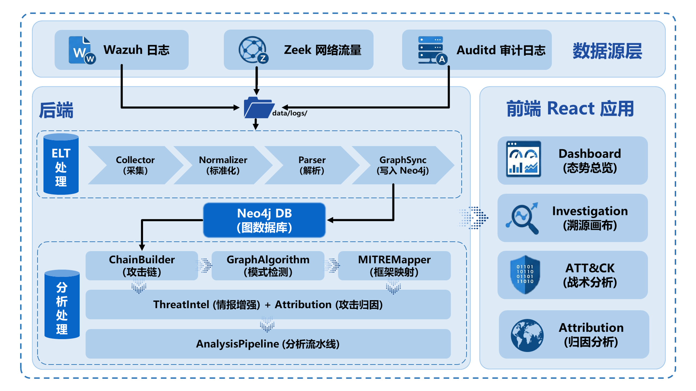

# Ariadne 操作手册

## 目录

1. [系统架构](#系统架构)
2. [环境要求](#环境要求)
3. [服务端部署](#服务端部署)
4. [客户端部署](#客户端部署)
5. [测试工具使用](#测试工具使用)
6. [配置说明](#配置说明)
7. [快速启动清单](#快速启动清单)
8. [数据管理与维护](#数据管理与维护)
9. [本地服务访问汇总](#本地服务访问汇总)
10. [常见问题](#常见问题)

## 系统架构



## 环境要求

### 服务端

- **操作系统**: Linux (推荐 Ubuntu 20.04+)
- **Docker**: 20.10+
- **Docker Compose**: 2.0+
- **Python**: 3.12+
- **Node.js**: 18+ (通过 conda 安装)
- **内存**: 建议 8GB+
- **硬盘**: 建议 50GB+

### 客户端

- **操作系统**: Linux (支持 apt 包管理)
- **网络**: 与服务端在同一网络环境


## 服务端部署

### 1. 启动 Neo4j 图数据库

```bash
docker run \
    --restart always \
    --publish=7474:7474 \
    --publish=7687:7687 \
    --env NEO4J_AUTH=neo4j/ariadne_neo4j \
    --volume=/home/Ariadne/data/neo4j_data:/data \
    neo4j
```

**访问地址:**
- Web 界面: `http://localhost:7474`
- Bolt 连接: `neo4j://localhost:7687`
- 默认账号: `neo4j` / `ariadne_neo4j`

### 2. 启动 Wazuh Manager

```bash
# 1. 调整系统内核参数
sudo sysctl -w vm.max_map_count=262144
cd /home/Ariadne/deploy/wazuh_server/single-node
# 初始化配置与证书权限
chown -R 1000:1000 ./config/
chmod 400 ./config/wazuh_indexer_ssl_certs/*.pem
docker-compose -p single-node up -d
```

**Wazuh 组件说明:**

| 组件 | 端口 | 说明 |
|------|------|------|
| Wazuh Manager | 1514/1515, 514/udp, 55000 | Agent 连接、Syslog、API |
| Wazuh Indexer | 9200 | 数据索引存储 |
| Wazuh Dashboard | 443 | Web 管理界面 |

**访问地址:**
- Dashboard: `https://localhost:443`

**默认账号:**
- Dashboard: `admin` / `SecretPassword`
- API: `wazuh-wui` / `MyS3cr37P450r.*-`

### 3. 启动 Logstash-Zeek 日志收集器

```bash
# 1. 离线加载 Logstash 镜像
docker load -i /root/logstash_8.10.2.tar

# 2. 准备配置与数据落地目录
mkdir -p /root/logstash/pipeline
mkdir -p /home/Ariadne/data/logs/zeek && chmod -R 777 /home/Ariadne/data/logs/zeek

# 3.将项目目录 config\wazuh_server\logstash_zeek\zeek.conf 中的内容完整复制并粘贴到宿主机的 /root/logstash/pipeline/zeek.conf 中

# 3. 启动接收容器
docker run -d \
    --name logstash-zeek \
    --restart always \
    -p 5044:5044 \
    -v /root/logstash/pipeline:/usr/share/logstash/pipeline:ro \
    -v /home/Ariadne/data/logs/zeek:/usr/share/logstash/external_data \
    logstash:8.10.2
```


### 4. Python 运行环境配置

```bash
# 在 /home/Ariadne/ 目录下运行
cd /home/Ariadne

# 创建 conda 环境
conda create -n ariadne python=3.12

# 激活环境
conda activate ariadne

# 安装 Python 依赖
pip install -r requirements.txt

# 安装 Node.js (用于前端)
conda install -c conda-forge nodejs
```

**Python 依赖包列表:**
- `fastapi` - Web 框架
- `uvicorn` - ASGI 服务器
- `pydantic` - 数据验证
- `neo4j` - 图数据库驱动
- `python-dotenv` - 环境变量管理
- `pandas` - 数据处理

### 5. 启动后端服务

```bash
cd /home/Ariadne/src/backend
python main.py
```

**后端 API 地址:** `http://localhost:8000`

**API 文档:** `http://localhost:8000/docs`

### 6. 启动前端服务

```bash
cd /home/Ariadne/src/frontend

# 安装前端依赖
npm install

# 启动开发服务器
npm run dev
```

**前端访问地址:** `http://localhost:5173`

**其他前端命令:**
```bash
# 生产构建
npm run build

# 预览构建结果
npm run preview

# 代码检查
npm run lint
```

**前端技术栈:**
- React 19 - UI 框架
- Vite 7 - 构建工具
- Ant Design 6 - 组件库
- ECharts 6 - 图表库
- Axios - HTTP 客户端


## 客户端部署

### 1. 安装 Wazuh Agent

使用自动安装脚本:

```bash
cd /home/Ariadne/deploy/sensor-agent

# 执行安装，参数为 Agent 名称
sudo ./install.sh <agent_name>

# 示例: 安装名为 node3 的 Agent
sudo ./install.sh node3
```

**手动安装步骤:**

```bash
# 1. 配置 Wazuh 软件源
curl -s https://packages.wazuh.com/key/GPG-KEY-WAZUH | \
    gpg --no-default-keyring --keyring gnupg-ring:/usr/share/keyrings/wazuh.gpg --import && \
    chmod 644 /usr/share/keyrings/wazuh.gpg

echo "deb [signed-by=/usr/share/keyrings/wazuh.gpg] https://packages.wazuh.com/4.x/apt/ stable main" | \
    tee /etc/apt/sources.list.d/wazuh.list > /dev/null

apt-get update -y

# 2. 安装 Agent (替换 MANAGER_IP 和 AGENT_NAME)
WAZUH_MANAGER="<Manager_IP>" WAZUH_AGENT_NAME="<Agent_Name>" apt-get install -y wazuh-agent

# 3. 启动服务
systemctl daemon-reload
systemctl enable wazuh-agent
systemctl restart wazuh-agent
```
### 2. 配置 Auditd 系统审计

**使用自动安装脚本:**

```bash

cd deploy/sensor-agent
# 赋予脚本执行权限
chmod +x configure_agent.sh

# 运行配置脚本
# 语法: sudo ./configure_agent.sh <Manager_IP> <Agent_Name>
sudo ./configure_agent.sh 172.31.65.2 node3
```

**手动安装步骤:**

1.安装 Auditd:

```bash
sudo apt-get install auditd -y
```

2.添加审计规则: 

编辑规则文件：

```bash
vi /etc/audit/rules.d/audit.rules
```
(如果该目录不存在，尝试直接编辑 /etc/audit/audit.rules)

在文件末尾添加以下内容（这是捕捉所有 64 位和 32 位命令执行的标准规则）：

```Plaintext
## 监控命令执行 (execve 系统调用)
-a always,exit -F arch=b64 -S execve -k audit-wazuh-c
-a always,exit -F arch=b32 -S execve -k audit-wazuh-c
```
应用规则:
```Bash
auditctl -R /etc/audit/rules.d/audit.rules
```
3.修改 Wazuh 监控配置: 

```Bash
# 假设当前在 deploy/sensor-agent 目录下
# 1. 备份原配置
cp /var/ossec/etc/ossec.conf /var/ossec/etc/ossec.conf.bak
# 2. 复制模板文件
cp ossec.conf /var/ossec/etc/ossec.conf
```
编辑 /var/ossec/etc/ossec.conf，找到以下占位符并修改为实际值：

将 MANAGER_IP_PLACEHOLDER 修改为 Manager IP (如 172.31.65.2)

将 AGENT_NAME_PLACEHOLDER 修改为当前主机名 (如 node3)

4.重启 Agent:
```Bash
systemctl restart wazuh-agent
```

### 2. 部署 Zeek 网络采集 (网关)

> 在网关或需要监控网络流量的节点上部署

```bash
cd /home/Ariadne/deploy/sensor-network

# 使用 docker-compose 部署
docker-compose up -d
```

### 3. 安装 Filebeat 

```bash
# 1. 离线安装 Filebeat
sudo dpkg -i /root/filebeat-8.10.2-amd64.deb

# 2. 修改配置 /etc/filebeat/filebeat.yml
# 核心参数：
#   paths: ["/opt/zeek-live-jsonl/conn.log"]
#   json.keys_under_root: true
#   output.logstash.hosts: ["172.31.65.2:5044"]

# 3. 启动服务
systemctl enable filebeat
systemctl restart filebeat
```

## 测试工具使用

### 日志模拟器

位置: `/home/Ariadne/src/backend/test/`

```bash
cd /home/Ariadne/src/backend/test

# 1. 完整攻击链测试 - 模拟 APT 攻击全流程
python advanced_log_simulator.py full_chain 3

# 2. 压力测试 - 生成大量日志测试系统性能
# 参数: <模式> <实例数> <持续秒数> <每秒事件数>
python advanced_log_simulator.py stress 1 60 100

# 3. 资产发现测试 - 模拟新主机上线
# 参数: <模式> <主机数量> <间隔秒数>
python advanced_log_simulator.py discovery 5 5

# 4. 横向移动专项测试
# 参数: <模式> <移动次数> <间隔>
python advanced_log_simulator.py lateral 10 3

# 5. 演示模式 - 逐步展示各种攻击技术
python advanced_log_simulator.py demo 5
```


## 配置说明

### 目录结构

```
/home/Ariadne/
├── config/                          # 配置文件目录
│   ├── logstash_zeek/              # Logstash 管道配置
│   │   └── zeek.conf
│   └── wazuh/                      # Wazuh 配置
│       ├── wazuh_cluster/
│       │   └── wazuh_manager.conf
│       └── wazuh_indexer_ssl_certs/  # SSL 证书
├── data/                           # 数据存储目录
│   ├── logs/
│   │   ├── wazuh/                  # Wazuh 日志
│   │   │   └── archives.json
│   │   └── zeek/                   # Zeek 日志
│   │       ├── conn.log
│   │       ├── dns.log
│   │       ├── files.log
│   │       └── http.log
│   └── neo4j_data/                 # Neo4j 数据
├── deploy/                         # 部署脚本
│   ├── sensor-agent/               # Agent 安装脚本
│   ├── sensor-network/             # 网络传感器部署
│   └── wazuh_server/               # Wazuh 服务端部署
├── src/                            # 源代码
│   ├── backend/                    # 后端 (FastAPI)
│   └── frontend/                   # 前端 (React)
└── requirements.txt                # Python 依赖
```

### 环境变量配置

可通过 `.env` 文件或环境变量配置:

| 变量名 | 默认值 | 说明 |
|--------|--------|------|
| `NEO4J_URI` | `neo4j://localhost:7687` | Neo4j 连接地址 |
| `NEO4J_USER` | `neo4j` | Neo4j 用户名 |
| `NEO4J_PASSWORD` | `ariadne_neo4j` | Neo4j 密码 |
| `LOG_PATH_WAZUH` | `/home/Ariadne/data/logs/wazuh/archives.json` | Wazuh 日志路径 |
| `LOG_DIR_ZEEK` | `/home/Ariadne/data/logs/zeek/` | Zeek 日志目录 |

### 端口汇总

| 服务 | 端口 | 协议 | 说明 |
|------|------|------|------|
| Neo4j Browser | 7474 | HTTP | Web 管理界面 |
| Neo4j Bolt | 7687 | TCP | 数据库连接 |
| Wazuh Agent | 1514 | TCP | Agent 通信 |
| Wazuh Agent | 1515 | TCP | Agent 注册 |
| Wazuh Syslog | 514 | UDP | Syslog 收集 |
| Wazuh API | 55000 | HTTPS | REST API |
| Wazuh Indexer | 9200 | HTTPS | OpenSearch |
| Wazuh Dashboard | 443 | HTTPS | Web 界面 |
| Logstash | 5044 | TCP | Beats 输入 |
| Backend API | 8000 | HTTP | 后端服务 |
| Frontend Dev | 5173 | HTTP | 前端开发服务器 |


## 快速启动清单

### 服务端完整启动顺序

```bash
# 1. 启动 Neo4j
docker run --restart always --publish=7474:7474 --publish=7687:7687 \
    --env NEO4J_AUTH=neo4j/ariadne_neo4j \
    --volume=/home/Ariadne/data/neo4j_data:/data neo4j

# 2. 启动 Wazuh
cd /home/Ariadne/deploy/wazuh_server && docker-compose up -d

# 3. 启动 Logstash
docker run -d --name logstash-zeek --restart always -p 5044:5044 \
    --user root \
    -v /home/Ariadne/config/logstash_zeek/:/usr/share/logstash/pipeline/ \
    -v /home/Ariadne/data/zeek/:/home/Ariadne/data/zeek/ \
    logstash:8.10.2

# 4. 激活 Python 环境
conda activate ariadne

# 5. 启动后端 (后台运行)
cd /home/Ariadne/src/backend && nohup python main.py > backend.log 2>&1 &

# 6. 启动前端
cd /home/Ariadne/src/frontend && npm run dev
```


## 数据管理与维护

### 数据备份

```bash
# 1. 备份 Neo4j 数据
docker exec <neo4j_container_id> neo4j-admin dump --to=/data/backup.dump
cp /home/Ariadne/data/neo4j_data/backup.dump /home/Ariadne/backups/

# 2. 备份配置文件
tar -czf /home/Ariadne/backups/config_$(date +%Y%m%d).tar.gz /home/Ariadne/config/

# 3. 备份日志数据
tar -czf /home/Ariadne/backups/logs_$(date +%Y%m%d).tar.gz /home/Ariadne/data/logs/
```

### 清理日志

```bash
# 清理旧的 Zeek 日志 (保留最近7天)
find /home/Ariadne/data/logs/zeek/ -name "*.log" -mtime +7 -delete

# 清理旧的 Wazuh 日志
find /home/Ariadne/data/logs/wazuh/ -name "*.json" -mtime +30 -delete
```

### 数据库维护

```bash
# 进入 Neo4j 容器
docker exec -it <neo4j_container_id> cypher-shell -u neo4j -p ariadne_neo4j

# 清空图数据库 (谨慎操作!)
MATCH (n) DETACH DELETE n;

# 查看数据库统计
CALL db.stats.retrieve('GRAPH COUNTS');
```

### 服务重启

```bash
# 重启单个服务
docker restart logstash-zeek
docker restart <neo4j_container_id>
cd /home/Ariadne/deploy/wazuh_server && docker-compose restart

# 重启后端服务
pkill -f "python main.py"
cd /home/Ariadne/src/backend && nohup python main.py > backend.log 2>&1 &
```


## 本地服务访问汇总

所有服务启动后，可通过以下地址访问：

| 服务 | 访问地址 | 说明 |
|------|---------|------|
| **Ariadne 前端** | http://localhost:5173 | 主应用界面 |
| **Ariadne API** | http://localhost:8000 | 后端 API |
| **API 文档** | http://localhost:8000/docs | FastAPI 自动生成的文档 |
| **Neo4j Browser** | http://localhost:7474 | 图数据库管理 |
| **Wazuh Dashboard** | https://localhost:443 | 安全监控面板 |

**推荐访问顺序：**
1. 首先访问 Neo4j Browser 确认图数据库连接正常
2. 访问 API 文档查看后端服务状态
3. 最后打开 Ariadne 前端开始使用


## 常见问题

### Q: Docker 容器启动失败？

检查端口是否被占用:
```bash
netstat -tlnp | grep <端口号>
```

### Q: Neo4j 连接失败？

1. 确认容器正在运行: `docker ps`
2. 检查防火墙是否开放 7474/7687 端口
3. 验证认证信息是否正确

### Q: Wazuh Agent 无法连接 Manager？

1. 检查 Manager IP 配置是否正确
2. 确认 1514/1515 端口可访问
3. 查看 Agent 日志: `/var/ossec/logs/ossec.log`

### Q: 前端无法连接后端 API？

1. 确认后端服务正在运行: `ps aux | grep python`
2. 检查后端日志: `tail -f /home/Ariadne/src/backend/backend.log`
3. 验证 CORS 配置是否正确

### Q: 如何停止所有服务？

```bash
# 停止前端 (Ctrl+C 或)
pkill -f "vite"

# 停止后端
pkill -f "python main.py"

# 停止 Docker 容器
docker stop logstash-zeek
cd /home/Ariadne/deploy/wazuh_server && docker-compose down
docker stop $(docker ps -q --filter ancestor=neo4j)
```

### Q: 如何查看服务运行状态？

```bash
# 查看 Docker 容器状态
docker ps

# 查看后端进程
ps aux | grep "python main.py"

# 查看端口占用情况
netstat -tlnp | grep -E "(7474|7687|8000|5173|1514|443|9200)"
```
